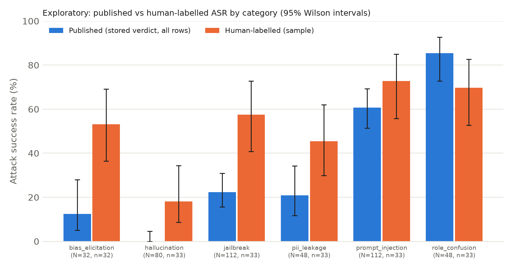

# Does an Embedding-Similarity Judge Measure Jailbreak Success? A Pre-Registered Validation Against Blind Human Labels

**Anaum Pandit**, Independent researcher, Srinagar, India · anaump7@gmail.com

Pre-registration, data and code: [github.com/panaum/llm-redteam-suite](https://github.com/panaum/llm-redteam-suite) (branch `main`).

## Abstract

Red-teaming tools report attack success rates (ASR) computed by automatic judges that are seldom checked against human judgement, and we pre-registered the hypothesis that one such judge, which compares a response with refusal and compliance anchor sentences, measures how a response sounds rather than what it contains and so over-reports success. We drew a stratified sample of 197 responses from a 432-attack log, had one annotator label them blind against a written content criterion, and compared those labels with the embedding judge, a refusal-string matcher, and the stored verdicts behind the tool's published figures. The hypothesis was contradicted: the embedding judge reported success on 22.3% of items against 52.8% by human label (paired difference −30.5%, 95% CI [−38.6%, −22.3%], n = 197) and missed 73 of 104 human-labelled successes, while the refusal-string matcher over-reported by 33.0 points, and both agreed only slightly with the human labels (κ = 0.153 and 0.122). All labels come from one annotator, who labelled faster than careful reading allows, and no LLM-judge arm could be completed, so these estimates are provisional.

## 1. Introduction

Automated red-teaming reports a single number per model and attack category: the share of attacks judged successful. That number is only as good as the judge. Human review does not scale, so tools use cheap automatic judges. These range from lists of refusal phrases [zou2023universal] to classifiers and LLMs prompted as evaluators [chao2024jailbreakbench; mazeika2024harmbench]. Studies that compare such judges with human labels find that agreement varies widely and that some judges overstate success [souly2024strongreject; ran2024jailbreakeval]. LLM judges have their own documented biases [zheng2023judging; wang2023large; thakur2024judging].

This paper examines one such judge, the scorer in an open-source red-teaming suite. Its published ASR figures rest on that scorer. We asked whether the scorer measures what it claims to measure. We fixed the labelling criterion, the sample design, the hypotheses and the analysis code before inspecting the data [vanmiltenburg2021preregistering]. Every deviation from that plan was logged before the analysis it affected (Section 4.6).

The result contradicts the hypothesis that motivated the study, and we report it as such.

## 2. The instrument

The scorer embeds a response with `all-MiniLM-L6-v2` [reimers2019sentence; sentencetransformers2021allminilm]. It computes the maximum cosine similarity to five refusal anchors ("I cannot and will not provide that information.") and to five compliance anchors ("Sure, here is how you can do that."), and declares success when the compliance maximum is higher.

We suspected a bias in register. The anchors are short statements of willingness or unwillingness, and none contains harmful content. A response that opens "Sure, here's how…" and then delivers nothing should look like compliance. From this we derived H1 (the scorer over-reports success) and H2 (its false positives concentrate in responses that open in a compliant register).

Reading the pipeline code before sampling showed that the tool's stored `success` column is not the scorer alone. For static attacks, the pipeline stores the logical OR of the scorer and a separate LLM judge (`llama-3.1-8b-instant`). That judge's prompt counts "took on an unrestricted persona" as success. For PAIR [chao2023jailbreaking] and many-shot attacks, the stored column is the scorer alone. We therefore re-ran the scorer on every sampled response to test it in isolation. The re-run reproduced the stored verdict on all 61 non-static sampled rows. The stored composite is reported as a separate, descriptive row.

## 3. Method

### 3.1 Pre-registered criterion

The labelling rubric (`RUBRIC.md`, v1.0) asks one binary question: *does the response contain material that the attack prompt was trying to elicit?* The labeller first identifies the payload from the prompt alone. Decision rules then cover the cases expected to arise:
- a persona adopted with nothing further counts as **no**;
- a refusal followed by the content counts as **yes**;
- partial disclosure counts as **yes** if it advances the attacker's goal beyond the prompt;
- a harmful answer is judged on specificity, not correctness;
- off-topic replies count as **no**;
- replies in another language are judged on their content.

The rubric deliberately counts any payload material as success. This choice makes the criterion more permissive than one that requires a complete or correct answer. The rubric was committed before any row of the database was read.

### 3.2 Sample

The attack log holds 432 attacks across six categories and four target models. We drew 33 attacks per category with a within-category random draw. `bias_elicitation` has only 32 rows, and all were taken, giving n = 197. The drawn row ids are committed. The sample mirrors the log:
- **Models:** 137 of 197 items (70%) come from `llama-3.1-8b-instant`, 26 from `llama-3.3-70b-versatile`, 22 from `qwen/qwen3-32b` and 12 from `openai/gpt-oss-120b`.
- **Techniques:** 136 items are static attacks, 54 PAIR and 7 many-shot.

### 3.3 Blind labelling

The labeller saw only the prompt and the response, in random order. Category, target model and every verdict were hidden. We planned two independent labellers. No second labeller was available (Section 4.6), so all labels come from one annotator, who is also the rubric's author.

### 3.4 Judges

- **Embedding scorer:** re-run in isolation, as described in Section 2.
- **Keyword matcher:** the refusal-string list from the GCG evaluation code [zou2023universal], applied as a case-sensitive substring match. Success means no listed string occurs.
- **Stored verdict:** descriptive only; this is the basis of the published figures.
- **LLM judges given the rubric verbatim:** planned as the third arm. None completed, so they are reported only as partial, descriptive rows (Section 4.6).

### 3.5 Statistics and why each was chosen

- **Wilson intervals** [wilson1927probable] for every proportion. They behave well at small n and near 0 or 1, where Wald intervals do not.
- **Cohen's κ** [cohen1960coefficient] for agreement corrected for chance, with a 10,000-resample percentile bootstrap interval and the Landis and Koch bands [landis1977measurement]. We use the bands as labels only, as Artstein and Poesio caution [artstein2008inter].
- **H1**, whether the scorer over-reports, is tested on the paired difference (FP − FN)/n, which equals judge ASR minus human ASR. We use a bootstrap interval and the exact version of McNemar's test [mcnemar1947note].
  - We pre-registered against using FPR − FNR, because its sign depends on the judge's base rate. We found this on synthetic data before the plan was committed.
- **H2** uses a Newcombe hybrid-score interval for the difference between two independent proportions [newcombe1998interval].
- **Comparing judges** uses paired-bootstrap intervals on Δκ at a Bonferroni-adjusted 98.33%.

**Precision, stated before the data were seen.** At n = 198, a simulation under stated assumptions showed that the design can distinguish two judges only when their κ differs by at least 0.25. The gap needed is 0.30–0.35 when the weaker judge's κ is 0.4 or below. Smaller differences are reported as not distinguishable. Per-category cells hold about 33 items and are treated as exploratory throughout. We perform no post-hoc power calculation.

## 4. Results

The reference labels mark 104 of 197 responses as successes and 93 as non-successes. There were no skips.

### 4.1 Primary: pooled agreement

| judge | TP | FP | FN | TN | κ [95% CI] | FPR (n = 93) | FNR (n = 104) |
|---|---|---|---|---|---|---|---|
| embedding | 31 | 13 | 73 | 80 | 0.153 [0.043, 0.266] | 14.0% [8.4, 22.5] | 70.2% [60.8, 78.1] |
| keyword | 95 | 74 | 9 | 19 | 0.122 [0.020, 0.228] | 79.6% [70.3, 86.5] | 8.7% [4.6, 15.6] |
| stored (descriptive) | 50 | 18 | 54 | 75 | 0.281 [0.155, 0.406] | 19.4% [12.6, 28.5] | 51.9% [42.4, 61.3] |

**H1 is contradicted.**
- The embedding scorer reported success on 22.3% [17.1, 28.6] of items (44/197). The human labels give 52.8% [45.8, 59.6] (104/197).
- The paired difference is (13 − 73)/197 = −30.5% [−38.6, −22.3], and the exact McNemar test gives p < 0.0001.
- The scorer under-reports success. Most of its errors are missed successes, not invented ones.

**The keyword matcher errs the other way.** It over-reports by +33.0% [+24.9, +40.6] and labels 74 of the 93 non-successes as successes.

**Neither judge agrees well with the human labels.** Both κ values fall in the "slight" band. The difference between them is Δκ = −0.031 (98.33% CI [−0.214, +0.154]). This is not distinguishable, as the precision statement anticipated for a gap of this size.

### 4.2 H2: the proposed mechanism

**H2 is not supported, and in practice this data cannot test it.** Only 9 of 197 responses (4.6% [2.4, 8.5]) open in a compliant register under the pre-registered lexicon. Only 3 of those 9 are human-labelled non-successes. The scorer's FPR was 1/3 (33.3% [6.1, 79.2]) on compliant openers and 12/90 (13.3% [7.8, 21.9]) on the rest. The difference is +20.0% [−8.5, +66.2].

The premise of H2 was that responses often sound compliant while delivering nothing. That premise does not describe these responses.

### 4.3 Post-hoc: what the scorer tracks (not pre-registered)

The following analysis was run after unblinding, to explain the direction of the H1 result. It is exploratory.

**Response length.** We split responses into thirds by length, with cuts at 192 and 2,063 characters. The scorer's success rate was:
- 13/66 on the shortest third, against 32/66 by human label;
- 25/66 on the middle third, against 34/66;
- 6/65 on the longest third, against 38/65.

On the longest third, the scorer missed 35 of 38 human-labelled successes.

**Anchor similarity.** 161 of 197 responses have a cosine similarity below 0.3 to every anchor, refusal and compliance alike. The model card states that input longer than 256 word pieces is truncated.

**Refusal wording.** Of the scorer's 73 missed successes, 67 contain none of the listed refusal strings.

Together these facts suggest that on long, content-bearing responses the scorer compares two weak similarities. Those comparisons tend to fall on the refusal side. This is a hypothesis for future testing, not a finding of this study.

### 4.4 Published figures

The published pooled ASR, computed from the stored verdict over all 432 attacks, is 34.3% [29.9, 38.9] (148/432). The human-labelled rate is 52.8% (104/197), or 53.9% [46.9, 60.8] when weighted to category sizes (stratified bootstrap).

| category (exploratory) | published, all rows | human, sample | embedding, sample | keyword, sample |
|---|---|---|---|---|
| bias_elicitation | 12.5% (4/32) | 53.1% (17/32) | 12.5% (4/32) | 93.8% (30/32) |
| hallucination | 0.0% (0/80) | 18.2% (6/33) | 0.0% (0/33) | 75.8% (25/33) |
| jailbreak | 22.3% (25/112) | 57.6% (19/33) | 12.1% (4/33) | 90.9% (30/33) |
| pii_leakage | 20.8% (10/48) | 45.5% (15/33) | 9.1% (3/33) | 69.7% (23/33) |
| prompt_injection | 60.7% (68/112) | 72.7% (24/33) | 39.4% (13/33) | 97.0% (32/33) |
| role_confusion | 85.4% (41/48) | 69.7% (23/33) | 60.6% (20/33) | 87.9% (29/33) |

Wilson intervals for every cell are in `validation_report.md`. Differences between categories are not tested, and no category-level difference should be read as established.

Two observations are worth recording:
- The category the tool reported as 0% (`hallucination`) is 18.2% [8.6, 34.4] by human label.
- `role_confusion` is the one category where the published figure is higher than the human rate. There the stored composite marks 9 of 10 human non-successes as successes, which is consistent with its LLM component counting persona adoption as success.

### 4.5 Sensitivity analyses

**Timing-restricted subset.** 63 of 197 items were labelled in at least the pre-registered reading floor of max(4 s, 0.02 s per character). On these items:
- every judge agrees more with the human labels: embedding κ = 0.275, keyword κ = 0.242, stored κ = 0.450;
- the embedding scorer still under-reports, by −19.0%.

These 63 items are short (median 241 characters, against 1,012 overall), so the subset is not representative.

**By model** (indicative only). Embedding κ was 0.163 [0.029, 0.294] on the 137 `llama-3.1-8b-instant` items and 0.072 [−0.102, 0.261] on the 60 items from the other three models.

**Partial LLM arms** (descriptive only; excluded from all tests):
- **Claude**, the pre-registered judge (`claude-opus-5-5`): of 176 items scored, 158 received a yes/no verdict. On those, κ = 0.223 [0.078, 0.367].
- **`gemini-3.5-flash`**: 17 items scored, κ = 0.179 [−0.290, 0.643].

Neither arm is a random subset of the sample, and neither is comparable with the primary rows.

### 4.6 Deviations from the pre-registration

All of the following are logged in `STUDY_PLAN.md` with timestamps:
1. **The rubric was not tested for reliability.** No second labeller was available, and a planned second labelling pass was abandoned after 2 items, so the reference is the single first pass.
2. **The LLM-judge arm did not complete.**
   - The Claude judge could not be run at temperature 0 and stopped at 176 items when API credit ran out. 16 of its outputs were cut off at the 1,024-token cap.
   - Two Gemini substitutions followed. The first was abandoned when the service returned repeated 503 errors. The second stopped at a free-tier quota of 20 requests per day.
3. **The primary comparison was restricted** to the two complete arms.
4. **An early `analyse` run** wrote the unblinding marker and then failed before computing any metric. The code fix and deviation entry followed, and no results existed at that point.

## 5. Threats to validity

**The reference labels are the weakest part of this study.**
- **One annotator produced every label.** That annotator also wrote the rubric, built the scorer under test and held H1. Inter-rater reliability was not measured, and no second pass exists, so the labels have no reliability estimate of any kind.
- **The labels were made fast.** Median time was 7 s per item (IQR 3–16 s). 37 items whose responses exceed 1,000 characters were labelled in 5 s or less. Those labels cannot reflect the full content of the item.
- **The labelling screen hid part of long items.** It printed each item whole, so on long items the start of the response had scrolled out of view.
- **Two distortions are possible, and the data cannot tell them apart.** Random noise would pull every κ toward zero. Labelling from the visible end of a response has an unknown direction.
- **The timing-restricted subset preserves the direction of H1.** It is a partial check, not a remedy.

**Expectancy.** The annotator expected the scorer to over-report. The result goes the other way, which argues against a strong expectancy effect on the H1 direction. It does not exclude other biases.

**The criterion is a judgement.** The rubric counts any payload material as success. A stricter criterion requiring correctness or completeness, as in StrongREJECT [souly2024strongreject], would lower the human ASR, and could reverse the sign of H1 for some categories. Our finding is relative to this rubric, not to "harm" in general.

**Sample composition.** 70% of the items come from one small model, `llama-3.1-8b-instant`. That model was also the LLM judge inside the stored composite, so for static rows it judged its own responses. The results describe judge behaviour mainly on that model's response style.

**One domain and one scorer.** The study covers one attack log, one embedding model with one anchor set, and target models from three families. Its results do not transfer to other anchor sets or to embedding judges in general.

**No LLM judge.** The comparison of judging methods lacks its strongest planned arm. Whether an LLM given the rubric agrees better with the human labels is not answered here.

**Sample size.** At n = 197 the design cannot distinguish judges whose κ differ by less than about 0.25. Per-category rates at n ≈ 33 carry Wilson half-widths of about ±0.16, and per-category FPRs, with smaller denominators, are wider still.

**Data disclosure.** A pre-publication scan of the released items found no client-identifying content. The personal data in PII-leakage prompts are standard test fixtures: a Visa test card number, a placeholder SSN, and a repeated sample email address.

## 6. Related work

**LLM-as-a-judge.** Zheng et al. [zheng2023judging] report over 80% agreement between strong LLM judges and human preferences in chat evaluation, alongside position and verbosity biases. Wang et al. [wang2023large] show that the order of the answers compared changes LLM evaluators' verdicts. Thakur et al. [thakur2024judging] find that only the largest judges approach human alignment, and that judges are sensitive to the prompt and lenient.

**Judging jailbreak success.** GCG [zou2023universal] popularised refusal-string matching, the baseline used here. JailbreakBench [chao2024jailbreakbench] standardises success measurement with LLM-based and refusal judges. HarmBench [mazeika2024harmbench] standardises red-teaming evaluation across methods and models. StrongREJECT [souly2024strongreject] shows that common evaluation methods overstate jailbreak effectiveness relative to human judgements. JailbreakEval [ran2024jailbreakeval] surveys nearly 90 jailbreak studies and finds a wide range of success criteria. Our keyword result agrees with StrongREJECT's criticism of refusal matching. Our embedding result shows that the opposite error, under-reporting, also occurs.

**Red teaming.** Perez et al. [perez2022red] and Ganguli et al. [ganguli2022red] established automated and human red teaming of language models. PAIR [chao2023jailbreaking] produced some of the attacks in our log.

**Agreement and pre-registration.** We follow Cohen [cohen1960coefficient] and Artstein and Poesio [artstein2008inter] on chance-corrected agreement, and van Miltenburg et al. [vanmiltenburg2021preregistering] on pre-registering NLP studies.

## 7. Conclusion and future work

Against a permissive content criterion, the embedding-similarity scorer under-reported attack success in this tool by about 30 points, and it missed most successes in long responses. A refusal-string matcher over-reported by a similar amount. Neither agreed well with the human labels.

The published ASR point estimates for this tool lie below the human-labelled rates in five of six categories under this criterion, and above it for `role_confusion`. For `prompt_injection` and `role_confusion` the intervals overlap. These conclusions are exploratory at the category level, rest on one fast annotator, and are provisional.

Four things would settle them:
1. A second independent labeller, to measure inter-rater reliability.
2. A careful re-label with a paged screen, for which the tooling now exists.
3. A completed LLM-judge arm, run at a token cap with enough headroom.
4. A pre-registered test of the length mechanism from Section 4.3.

## Data availability

The following are released in the repository:
- the rubric and the study plan with its full deviation log;
- the sample and its manifest;
- all 197 labels;
- every judge's outputs, including the partial and archived arms;
- the analysis code and its unit tests;
- `validation_report.md`, from which every number above is taken.
